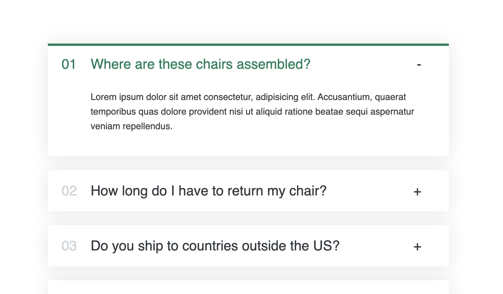

# Accordion Practice

This mini-project was a practice of accordions similar to a FAQ page

## Description

In this project opening an accorion item would close any open accordion item, so this required "lifting the state up" from accordion items to the whole accordion component. Also the accordion items used "children" prop, so this was another concept I practiced in this project.

    ```md
    
    ```

## Installation

- Install npm if you don't see a version number from the following command on the terminal.

```
npm -v
```

- Install package.json

```
npm install package.json
```

- Run on local computer

```
npm start
```

## Credits

This was from the fantastic Jonas Schmedtmann's Ultimate React Tutorial on Udemy
https://www.udemy.com/course/the-ultimate-react-course/
https://github.com/jonasschmedtmann/
